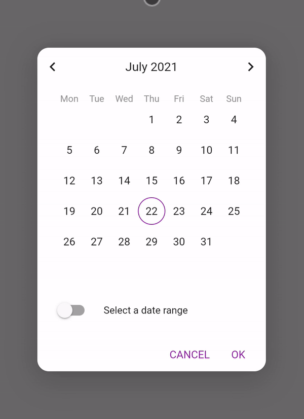

# Awesome Calendar

An easy to use and customizable calendar for Flutter.

The calendar can be used with the provided AlertDialog or as a Widget embedded the way you want. It allows single, multi and range selection.



## Installation

Add to `pubspec.yaml` in `dependencies` 

```
  awesome_calendar: ^1.0.0
```
## Basic usage

```
final List<DateTime>? picked = await showDialog<List<DateTime>>(
  context: context,
  builder: (BuildContext context) {
    return const AwesomeCalendarDialog(
      selectionMode: SelectionMode.MULTI,
      canToggleRangeSelection: true,
    );
  },
);
```

Check out [examples](https://github.com/molteo-engineering-team/awesome_calendar/tree/main/example/lib/main.dart) to see more usage samples

## Found this project useful? ❤️

If you found this project useful, then please consider giving it a ⭐️ on Github and sharing it with your friends.

## License ⚖️

[MIT](https://github.com/molteo-engineering-team/awesome_calendar/tree/main/LICENSE)

## Issues and feedback 💭

If you have any suggestion for including a feature or if something doesn't work, feel free to open a Github [issue](https://github.com/molteo-engineering-team/awesome_calendar/issues) for us to have a discussion on it.
